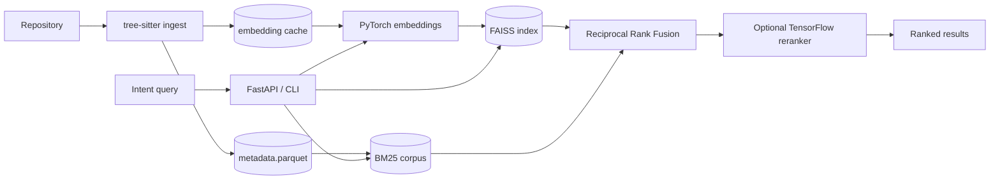

# Semantic Code Search Engine


[](https://github.com/pintarkristian/semantic-code-search-engine/actions/workflows/ci.yml)


> **Search your codebase by what you mean, not what you typed.**

**semcode** is a local, hybrid semantic code search engine. You describe what a piece of code *does*
in plain English; it returns the functions, methods, and classes that match your intent — ranked by
meaning, not by string overlap. The full pipeline is implemented and tested: tree-sitter ingestion →
PyTorch embeddings (with a content-hash cache) → FAISS + BM25 hybrid retrieval fused with Reciprocal
Rank Fusion → an optional TensorFlow learned re-ranker → a production-style FastAPI service.

---

## Table of Contents

- [The Problem](#the-problem)
- [How It Works](#how-it-works)
- [Features](#features)
- [Architecture](#architecture)
- [Why PyTorch *and* TensorFlow?](#why-pytorch-and-tensorflow)
- [Tech Stack](#tech-stack)
- [Installation](#installation)
- [Usage](#usage)
  - [Command-line interface](#command-line-interface)
  - [HTTP API](#http-api)
  - [Docker](#docker)
- [Configuration](#configuration)
- [How It Works in Depth](#how-it-works-in-depth)
- [Project Layout](#project-layout)
- [Development](#development)
- [Performance Snapshot](#performance-snapshot)
- [Limitations](#limitations)
- [Roadmap](#roadmap)
- [License](#license)

---

## The Problem

Every developer knows the frustration: you vaguely remember a function that "validates a JWT and
extracts the user role", but `grep -r "jwt"` returns 400 matches and `Ctrl+Shift+F` in the IDE gives
you token noise. You end up manually skimming files for ten minutes to find twenty lines of code.

This is the fundamental limitation of **lexical search** — it matches characters, not concepts. It
has no understanding of what code *does*, only what it literally *says*. If the function you are
looking for is called `_check_bearer`, a keyword search for "JWT" will never surface it.

**semcode** addresses this with semantic search. You describe your *intent* in plain English and the
engine finds the code that satisfies it, regardless of the specific identifiers used. Ask *"where
does the app validate a token and return the user's claims?"* and the engine returns the relevant
code chunks ranked by meaning.

The target audience is developers working on large, unfamiliar codebases — onboarding to a new team,
doing security reviews, or navigating a legacy monorepo where the naming conventions were invented by
someone who left three years ago.

---

## How It Works

At a glance, one command indexes a repository and another searches it:

```console
$ python -m semcode index ./my-project
[semcode] ingested and indexed 842 chunks  dim=768  embedded=842  cache_hits=0  embedding_ms=9421.7  elapsed_ms=11302.4  -> data/index.faiss

$ python -m semcode search "validate a JWT and extract the user role"
Results for: 'validate a JWT and extract the user role'

#1  score=0.0164  auth/middleware.py:42  (_check_bearer · python)
    def _check_bearer(token: str) -> UserClaims:
        """Validate a bearer token and return the caller's claims."""
        payload = jwt.decode(token, _PUBLIC_KEY, algorithms=["RS256"])
        return UserClaims(user_id=payload["sub"], role=payload["role"])

#2  score=0.0112  auth/tokens.py:15  (TokenValidator · python)
    class TokenValidator:
        ...
```

Note that `_check_bearer` is returned for a query that never mentions "bearer" — the dense embedding
matches on *meaning*, while BM25 keeps exact identifier matches honest. The two signals are combined
with Reciprocal Rank Fusion.

---

## Features

- **Intent-based search.** Natural-language queries are embedded with a code-aware bi-encoder and
  matched against code by semantic similarity, not keyword overlap.
- **Hybrid retrieval.** Dense vector search (FAISS) and sparse lexical search (BM25 with
  identifier-aware tokenization) run independently and are fused with weighted Reciprocal Rank
  Fusion — you get the recall of semantics *and* the precision of exact symbol matches.
- **AST-aware chunking.** Source is parsed with tree-sitter into function / method / class chunks
  with real line spans and docstrings, for **Python, JavaScript, TypeScript, Go, and Java**. Files
  that can't be parsed fall back to overlapping sliding-window chunks so nothing is lost.
- **Learned re-ranking (optional).** A compact TensorFlow/Keras MLP re-scores fused candidates from
  engineered features (dense score, BM25 score, RRF score, symbol-token overlap, length ratio,
  language one-hots, docstring match). It degrades gracefully to the fused score when no model is
  present.
- **Incremental indexing.** A content-hash embedding cache plus a stable `vector_id` mapping means
  re-indexing only embeds chunks whose content changed; unchanged chunks are reused, and FAISS / BM25
  are updated in place rather than rebuilt.
- **Production-style API.** A FastAPI service with background indexing jobs, liveness/readiness
  health checks, Prometheus metrics, per-request IDs, configurable rate limiting and request
  timeouts, CORS, and structured JSON error responses.
- **First-class CLI.** `index`, `search`, `serve`, and `train-reranker` subcommands built with Typer.
- **Operable by default.** Multi-stage Docker image (non-root, slim runtime), `docker-compose`,
  structured logging via structlog (pretty for dev, JSON for prod), and a manifest that refuses to
  load an index built with a different model or dimension.
- **Tested.** A comprehensive pytest suite (~276 tests) covering ingestion, embedding/caching,
  indexing, search, fusion, the re-ranker, the CLI, and async API integration, gated at ≥75%
  coverage in CI (lint → typecheck → test).

---

## Architecture

The system is two pipelines — **indexing** and **search** — that share one embedding model and one
set of on-disk artifacts.



### Component overview

| Stage | Module | What it does |
|---|---|---|
| **Ingest** | [`semcode.ingest`](semcode/ingest/__init__.py) | Walks a repo (honouring `.gitignore` and skipping vendored/build dirs), parses files with [tree-sitter](semcode/ingest/_ast.py), and extracts function/class/method chunks with file path, line span, symbol name/type, and docstring. Falls back to 50-line / 25-line-stride sliding windows for unparseable files. Persists a pandas DataFrame to parquet. |
| **Embed** | [`semcode.embed`](semcode/embed/__init__.py) | Loads a code-aware sentence-transformer (lazily, as a singleton) via PyTorch, batch-encodes chunk text to L2-normalised float32 vectors, and validates shape/finiteness before anything reaches disk. A SHA-256 **content-hash cache** lets unchanged chunks skip re-embedding. |
| **Index** | [`semcode.index`](semcode/index/__init__.py) | Builds a FAISS `IndexFlatIP` (exact) below 10k vectors and an `IndexIVFFlat` (trained, inner-product) above it, wrapped in an `IndexIDMap2` for stable IDs. Writes a manifest (model, dimension, chunk count, built-at) and refuses to load on mismatch. `IndexingPipeline` orchestrates ingest → embed → FAISS + BM25 build, with diff-based incremental updates. |
| **Search** | [`semcode.search`](semcode/search/__init__.py) | Encodes the query once, retrieves top-K from FAISS and BM25 independently, fuses them with weighted RRF (k=60), joins metadata, and returns `SearchResult` pydantic objects carrying per-source scores. Includes a terminal renderer. |
| **Rerank** | [`semcode.rerank`](semcode/rerank/__init__.py) | A Keras MLP that re-scores fused candidates from 12 engineered features. Ships its own [dataset builder](semcode/rerank/dataset.py), [feature engineering](semcode/rerank/features.py), and [training loop](semcode/rerank/model.py) (early stopping, class weighting, AUC/accuracy), saved as a TF SavedModel. Falls back to the fused score when unavailable. |
| **API** | [`semcode.api`](semcode/api/__init__.py) | FastAPI app with lifespan model loading, CORS, request-id + rate-limit + timeout middleware, Prometheus metrics, JSON error handlers, and background indexing jobs. |
| **Config / Logging** | [`semcode.config`](semcode/config.py) · [`semcode.logging`](semcode/logging.py) | Typed pydantic-settings `Settings` (env-driven, validated) and structlog wiring (pretty or JSON). |

See [ARCHITECTURE.md](ARCHITECTURE.md) for the full indexing and search lifecycles.

---

## Why PyTorch *and* TensorFlow?

In most production systems you standardise on one ML framework. This project deliberately uses both,
but gives each a **distinct, defensible role** rather than duplicating work.

### PyTorch — bi-encoder embeddings

PyTorch handles the heavy lifting in [`semcode.embed`](semcode/embed/__init__.py) and all query
encoding. The reason is straightforward: the best pretrained code models — CodeBERT, GraphCodeBERT,
StarEncoder, and the CodeSearch-tuned DistilRoBERTa used by default — are PyTorch-native and
distributed through Hugging Face Transformers. The `sentence-transformers` library, which provides
clean pooling, normalisation, and batching on top of those models, is also PyTorch-native.

The **bi-encoder** architecture is the right choice here because it encodes each chunk *once* at index
time and stores the resulting vector. At query time, only the query needs encoding — the stored
vectors are fetched directly. This makes FAISS lookup sub-millisecond regardless of index size, which
is essential for an interactive developer tool. PyTorch's dynamic graph also keeps the door open to
fine-tuning the embedding model on a domain-specific corpus later without rewriting infrastructure.

### TensorFlow — learned re-ranker

TensorFlow handles [`semcode.rerank`](semcode/rerank/model.py). The re-ranker is a different kind of
ML component: it does **not** produce embeddings. Instead, it receives a set of already-retrieved
candidate chunks and re-scores each one using *engineered features* — the dense similarity score, the
BM25 score, the RRF score, exact symbol-name token overlap, query-to-code length ratio, language
one-hots, and whether query tokens appear in the docstring.

This is a small Keras MLP (`Normalization → Dense(32) → Dropout → Dense(16) → Dropout → Dense(1,
sigmoid)`) trained on `(query, candidate, relevant?)` triplets with its own dataset construction
script, an early-stopping training loop with AUC/accuracy logging and class weighting, and is saved
in TF SavedModel format so it can be served independently via TF Serving if needed.

Using TensorFlow here is a deliberate architectural boundary: the re-ranker is a separable, trainable
component with a clean feature interface. It can be hot-swapped, retrained on new labelled data, or
replaced with a different TF model without touching the PyTorch embedding pipeline.

**pandas** sits between both stages — it manages chunk metadata, drives the feature engineering for
the re-ranker, and stores the training dataset.

---

## Tech Stack

| Layer | Technology | Version |
|---|---|---|
| Language | Python | 3.11+ |
| Web framework | FastAPI + Uvicorn | 0.115 / 0.32 |
| CLI | Typer | 0.25 |
| Settings | Pydantic v2 + pydantic-settings | 2.10 / 2.6 |
| AST parsing | tree-sitter (+ python/js/ts/go/java grammars) | 0.25 |
| Embeddings | PyTorch + Transformers + sentence-transformers | 2.5 / 4.47 / 5.5 |
| Dense index | FAISS (CPU) | 1.9 |
| Sparse index | BM25 (rank-bm25) | 0.2 |
| Re-ranking | TensorFlow / Keras | 2.18 |
| Data wrangling | pandas + pyarrow + NumPy | 2.2 / 18.1 / 2.0 |
| Observability | structlog + prometheus-client | 24.4 / 0.21 |
| Linting / formatting | Ruff + Black | 0.8 / 24.10 |
| Type checking | mypy | 1.13 |
| Testing | pytest + pytest-asyncio + pytest-cov + httpx | 8.3 / 0.24 / 6.0 / 0.28 |

Exact pins live in [`requirements.txt`](requirements.txt) (runtime) and
[`requirements-dev.txt`](requirements-dev.txt) (dev/test).

---

## Installation

### Requirements

- Python **3.11+**
- ~2 GB free disk for dependencies (TensorFlow and PyTorch are large) plus a few hundred MB for the
  embedding model, downloaded on first use.
- CPU is fine. The defaults target CPU; GPU is opt-in (see [Configuration](#configuration)).

### Local (venv)

```bash
# 1. Clone
git clone https://github.com/pintarkristian/semantic-code-search-engine.git
cd semantic-code-search-engine

# 2. Create a Python 3.11 virtual environment
python3.11 -m venv .venv
source .venv/bin/activate          # Windows: .venv\Scripts\activate

# 3. Install (runtime + dev tooling)
make install                       # or: pip install -r requirements-dev.txt

# 4. (Optional) configure
cp .env.example .env               # edit to taste; all values have sane defaults
```

> First search/index downloads the embedding model (`st-codesearch-distilroberta-base`, ~300 MB) from
> Hugging Face. Subsequent runs use the local cache.

---

## Usage

### Command-line interface

The package is runnable as a module: `python -m semcode <command>`.

```bash
# Index a repository (incremental by default; --rebuild forces a full rebuild)
python -m semcode index /path/to/repo
python -m semcode index /path/to/repo --rebuild

# Search the current index
python -m semcode search "decode a base64 string"
python -m semcode search "open a database connection" --k 5
python -m semcode search "send an email" --no-reranker      # skip the learned re-ranker

# Run the HTTP API
python -m semcode serve --host 0.0.0.0 --port 8000

# Train the TensorFlow re-ranker from a labels file
python -m semcode train-reranker labels.json --epochs 20 --negatives-per-query 8
```

| Command | Key options | Description |
|---|---|---|
| `index <repo_path>` | `--rebuild / --no-rebuild` | Walk, parse, embed, and index a repo. Incremental by default. |
| `search <query>` | `--k`, `--reranker / --no-reranker` | Hybrid search; prints ranked results with snippets. |
| `serve` | `--host`, `--port` | Start the FastAPI server (overrides config). |
| `train-reranker <labels.json>` | `--dataset`, `--epochs`, `--negatives-per-query` | Build a feature dataset from labelled queries and train the re-ranker SavedModel. |

The labels file maps queries to relevant `chunk_id`s, in either shape:

```json
{ "validate JWT token": ["ed1ee4d339269960", "f96f7a5b1310b028"] }
```
```json
[ { "query": "validate JWT token", "relevant_chunk_ids": ["ed1ee4d339269960"] } ]
```

### HTTP API

Start the server (`python -m semcode serve` or `make run`) and open
[http://localhost:8000/docs](http://localhost:8000/docs) for interactive Swagger UI.

| Method | Path | Description |
|---|---|---|
| `GET` | `/health` | Liveness **and** readiness. Reports `index_loaded`, the active model, and any missing artifacts. A fresh service is `up` but not `ready` until an index exists. |
| `GET` | `/version` | App version, model name, readiness, and the persisted index manifest. |
| `GET` | `/metrics` | Prometheus metrics: request counts, request/search latency histograms, index chunk gauge. |
| `POST` | `/index` | Index a repo. Body `{"repo_path": "...", "rebuild": false}`. Runs as a background job, returns `202` + `job_id`. |
| `GET` | `/index/status/{job_id}` | Poll a background indexing job (status, chunk count, dimension, error). |
| `GET` | `/search` | Search. Query params: `q`, `k` (≤ `MAX_SEARCH_K`), `use_reranker`. |
| `GET` | `/stats` | Chunk count, per-language breakdown, model name, and manifest. |
| `DELETE` | `/index` | Remove all persisted index artifacts and reset the in-memory searcher. |

Cross-cutting behaviour: every response carries an `x-request-id`; requests are rate-limited per
client (configurable, with `/health`, `/version`, `/metrics` exempt) and time-limited (504 on
timeout); errors return a structured `{"error": {...}}` JSON body.

#### Example

```bash
curl "http://localhost:8000/search?q=validate+JWT+and+extract+user+role&k=3"
```

```json
{
  "query": "validate JWT and extract user role",
  "latency_ms": 38.2,
  "results": [
    {
      "rank": 1,
      "score": 0.0164,
      "rerank_score": null,
      "dense_score": 0.91,
      "bm25_score": 0.73,
      "fused_score": 0.0164,
      "chunk_id": "ed1ee4d339269960",
      "file_path": "auth/middleware.py",
      "symbol_name": "_check_bearer",
      "symbol_type": "function",
      "language": "python",
      "start_line": 42,
      "end_line": 68,
      "snippet": "def _check_bearer(token: str) -> UserClaims:\n    ..."
    }
  ]
}
```

More ready-to-run requests are in [examples/curl.md](examples/curl.md), and
[examples/queries.py](examples/queries.py) drives a batch of intent-style queries against a running
server:

```bash
python examples/queries.py --base-url http://localhost:8000 --k 3
```

### Docker

```bash
# Build and start the API (data/ is mounted for index persistence)
docker compose up --build          # or: make docker-up

# In another shell
curl http://localhost:8000/health
curl "http://localhost:8000/search?q=parse+a+config+file&k=5"
```

The image is a multi-stage, non-root, slim-runtime build (see [Dockerfile](Dockerfile)). It logs JSON
and serves on port 8000 by default. An optional **Qdrant** profile is available for vector-store
experiments — `docker compose --profile qdrant up --build` — though the application path remains
FAISS-first so local use and tests need no external service.

---

## Configuration

All settings are typed and validated in [`semcode/config.py`](semcode/config.py) and can be set via
environment variables or a `.env` file (see [`.env.example`](.env.example)).

| Variable | Default | Description |
|---|---|---|
| `APP_NAME` | `semcode` | Application name. |
| `DEBUG` | `false` | Debug flag (`release`/`prod`/`production` coerce to false). |
| `HOST` / `PORT` | `0.0.0.0` / `8000` | API bind address. |
| `LOG_LEVEL` | `INFO` | `DEBUG`/`INFO`/`WARNING`/`ERROR`/`CRITICAL`. |
| `LOG_FORMAT` | `pretty` | `pretty` (dev) or `json` (prod/Docker). |
| `REQUEST_TIMEOUT_SECONDS` | `30` | Per-request timeout (504 on exceed). |
| `RATE_LIMIT_REQUESTS` | `120` | Requests per window per client (`0` disables). |
| `RATE_LIMIT_WINDOW_SECONDS` | `60` | Rate-limit window. |
| `EMBEDDING_MODEL_NAME` | `flax-sentence-embeddings/st-codesearch-distilroberta-base` | Any sentence-transformers model (768-dim by default). |
| `EMBEDDING_DEVICE` | `cpu` | `cpu` or `cuda` (falls back to CPU if CUDA is unavailable). |
| `BATCH_SIZE` | `64` | Embedding batch size. |
| `MAX_CHUNK_TOKENS` | `512` | Approx. token budget per chunk (×4 chars). |
| `DATA_DIR` | `data` | Root for all persisted artifacts. |
| `FAISS_INDEX_PATH` | `data/index.faiss` | FAISS index (manifest is the sibling `.json`). |
| `METADATA_PATH` | `data/metadata.parquet` | Chunk metadata. |
| `RERANKER_MODEL_PATH` | `data/reranker` | TF SavedModel directory. |
| `TOP_K_RETRIEVE` | `50` | Candidates fetched from each source before fusion. |
| `TOP_K_RETURN` | `10` | Results returned by default. |
| `MAX_QUERY_LENGTH` | `512` | Max query length accepted by the API. |
| `MAX_SEARCH_K` | `100` | Upper bound on `k`. |
| `USE_RERANKER` | `false` | Default for the optional re-ranking stage. |
| `DENSE_WEIGHT` / `BM25_WEIGHT` | `0.7` / `0.3` | RRF fusion weights (must be non-negative; at least one positive). |

---

## How It Works in Depth

**Ingestion & chunking.** [`CodeIngestor`](semcode/ingest/__init__.py) walks the repo with `rglob`,
skips a curated set of vendored/build directories (`.git`, `node_modules`, `venv`, `dist`, …) and any
path matched by the repo's `.gitignore`, then dispatches each recognised file to tree-sitter. Chunk
node types are language-specific (e.g. Python `function_definition`/`class_definition`; Java also
captures interfaces and constructors). Python docstrings are read from the AST; other languages use
the leading comment block. Files that yield no AST chunks fall back to overlapping line windows. Each
chunk gets a stable 16-char `chunk_id` and a SHA-256 `content_hash` of the exact text that will be
embedded.

**Embedding & caching.** [`chunk_to_text`](semcode/embed/__init__.py) composes `symbol: <name>` +
docstring + code into one string (truncated to the token budget). [`Embedder`](semcode/embed/__init__.py)
lazily loads the sentence-transformer once and encodes batches to L2-normalised float32, validating
that the output has the expected shape, dimension, and no NaN/Inf before use. The
[`EmbeddingCache`](semcode/embed/__init__.py) is a content-hash-keyed pickle under `DATA_DIR`; it is
ignored on model/dimension change so stale vectors can never leak into a new index.

**Hybrid retrieval & fusion.** [`VectorStore`](semcode/index/__init__.py) keeps row *i* of FAISS
aligned to `vector_id` *i* of the metadata, choosing `IndexFlatIP` for exact search under 10k vectors
and a trained `IndexIVFFlat` above. [`BM25Retriever`](semcode/search/_bm25.py) tokenizes
identifier-aware (`getUserName` → `get`, `user`, `name`; `XMLParser` → `xml`, `parser`). At query time
[`Searcher`](semcode/search/__init__.py) embeds the query once, retrieves `TOP_K_RETRIEVE` from each
source, and combines them with weighted **Reciprocal Rank Fusion** (`weight / (60 + rank)`), so a
document strong in either source surfaces.

**Re-ranking.** When enabled and a SavedModel exists, [`ReRanker`](semcode/rerank/model.py) builds the
12-feature matrix for the fused candidates and re-scores them in `[0, 1]`. Any failure (missing model,
shape mismatch, runtime error) falls back to the fused score, so search never breaks.

**Incremental indexing.** On re-index, [`IndexingPipeline`](semcode/index/__init__.py) loads the
prior metadata, diffs by `(chunk_id, content_hash)` into added/updated/removed/unchanged, reuses
`vector_id`s for surviving chunks, embeds only changed content (cache-backed), and applies a FAISS
`remove_ids` + `add_with_ids` update plus a BM25 corpus that reuses unchanged token lists. A changed
model, changed dimension, missing artifacts, or a legacy non-ID-mapped index forces a one-time full
rebuild.

---

## Project Layout

```
semcode/
  __main__.py        # Typer CLI: index / search / serve / train-reranker
  config.py          # pydantic-settings Settings (env-driven, validated)
  logging.py         # structlog setup (pretty | json)
  ingest/
    __init__.py      # CodeIngestor: repo walk, chunking, parquet
    _ast.py          # tree-sitter parsers + chunk extraction
  embed/__init__.py  # Embedder, content-hash EmbeddingCache, embed_dataframe*
  index/__init__.py  # VectorStore (FAISS) + IndexingPipeline (incremental)
  search/
    __init__.py      # Searcher, RRF fusion, SearchResult, formatter
    _bm25.py         # identifier-aware tokenizer + BM25Retriever
  rerank/
    features.py      # feature engineering (12 columns)
    dataset.py       # labelled-query -> training rows
    model.py         # Keras MLP build/train + ReRanker inference
  api/__init__.py    # FastAPI app, middleware, endpoints, jobs
scripts/             # build_reranker_dataset.py
examples/            # curl.md, queries.py
tests/               # ~276 tests + fixtures/sample_repo
data/                # persisted index, metadata, BM25, reranker SavedModel
```

---

## Development

```bash
make install      # editable install + dev deps
make lint         # ruff check + mypy
make format       # black + ruff --fix
make test         # pytest with coverage (fails under 75%)
make run          # uvicorn with --reload
```

- **Fast vs slow tests.** The default suite uses deterministic mock embedders for speed and
  reproducibility. Tests that download and run real models are marked `@pytest.mark.slow` and skipped
  unless opted in.
- **Coverage gate.** `pytest` enforces `--cov-fail-under=75` (see [`pyproject.toml`](pyproject.toml)).
- **CI.** [GitHub Actions](.github/workflows/ci.yml) runs Ruff → Black → mypy → pytest on every push
  and PR (Python 3.11, models offline).
- **Contributing.** See [CONTRIBUTING.md](CONTRIBUTING.md) for local setup, the fast-check loop, and
  PR expectations.

---

## Performance Snapshot

Measured on the bundled fixture repository with the deterministic test embedder:

| Run | Chunks | Embedded | Cache hits | Embedding time | Total pipeline time |
|---|---:|---:|---:|---:|---:|
| First index | 16 | 16 | 0 | 3.08 ms | 47.6 ms |
| No-change re-index | 16 | 0 | 16 | 1.75 ms | 89.0 ms |

On a corpus this small, total time is dominated by ingest and artifact persistence. The meaningful
signal is that unchanged re-indexing embeds **zero** chunks and reaches a 100% cache-hit rate — the
incremental path works as intended. Real-model embedding time scales with corpus size and hardware.

---

## Limitations

- **CPU-only by default.** FAISS and model inference run on CPU. GPU requires setting
  `EMBEDDING_DEVICE=cuda` and a CUDA-capable PyTorch (and `faiss-gpu` for GPU FAISS).
- **Single-repo indexing.** One repository is indexed at a time into one shared `data/` directory.
- **English queries.** The default bi-encoder is trained on English; non-English queries degrade.
- **Large dependencies.** PyTorch + TensorFlow together add well over 1 GB to the environment; the
  embedding model adds a few hundred MB on first use.
- **Re-ranker needs labels.** The TF MLP requires `(query → relevant chunk)` pairs to train. Quality
  on a new codebase depends on the effort put into labelling; without a trained model, search uses the
  fused score directly.

---

## Roadmap

The core engine is implemented and tested end to end (ingest → embed → index → hybrid search →
optional re-rank → API), with Docker, CI, and observability in place at **v0.1.0**. Possible next
steps:

- **Evaluation harness** — a labelled query set reporting Recall@k / MRR / nDCG before vs. after the
  TF re-ranker, turning "it feels better" into a measured result.
- **VS Code extension** or a small web UI over the FastAPI backend.
- **Multi-repo / workspace indexing** with per-repo filters at search time.
- **Fine-tuning pipeline** — contrastive training (e.g. on CodeSearchNet) to adapt the bi-encoder to
  a specific codebase.
- **Lighter re-ranker inference** — evaluate ONNX Runtime to avoid shipping full TensorFlow.

---

## License

[MIT](LICENSE) © Kristian Pintar
